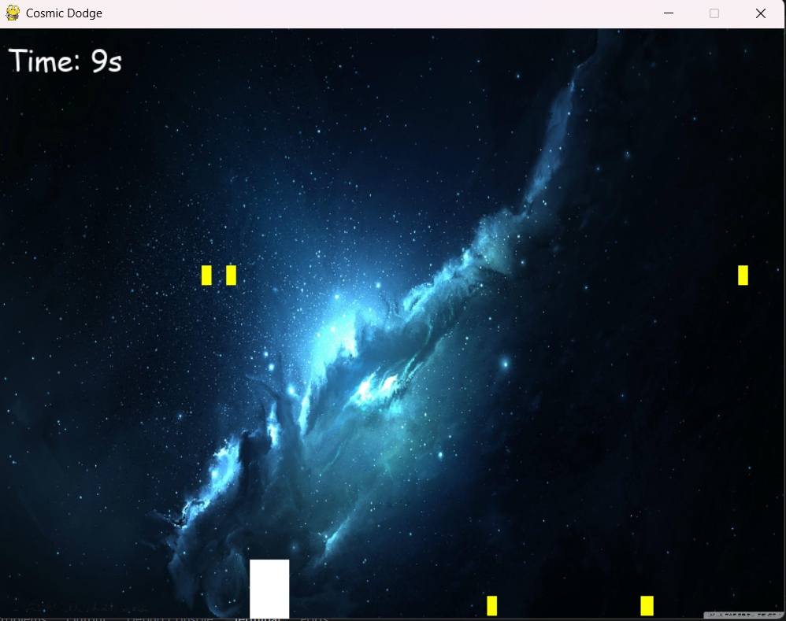

# Cosmic Dodge 🚀



A simple 2D space-dodging game built with Python and Pygame.

The player controls a spaceship at the bottom of the screen and must avoid falling stars. The goal is to survive for as long as possible. As the game continues, stars appear more frequently, making the game progressively more challenging.

## Features

- Simple spaceship movement
- Left and right keyboard controls
- Falling obstacles
- Collision detection
- Increasing difficulty over time
- Survival timer
- Game-over screen
- Space-themed background
- Randomly generated falling stars

## Technologies Used

- Python 3
- Pygame

## Requirements

Python 3 must be installed on your computer.

The game also requires the Pygame library.

Install Pygame using:

```bash
pip install pygame
